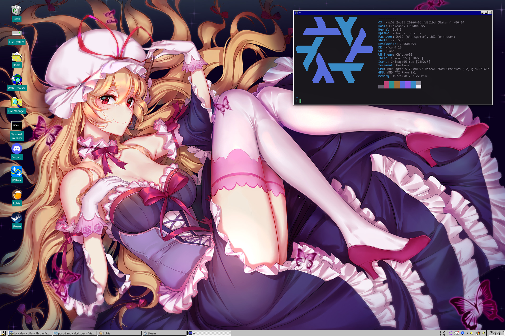
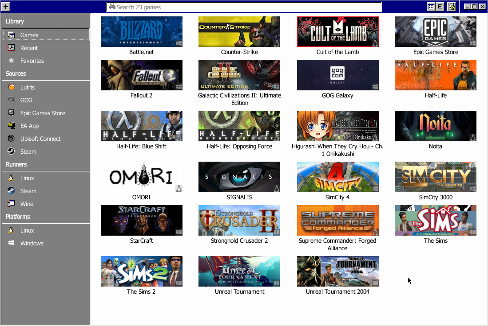
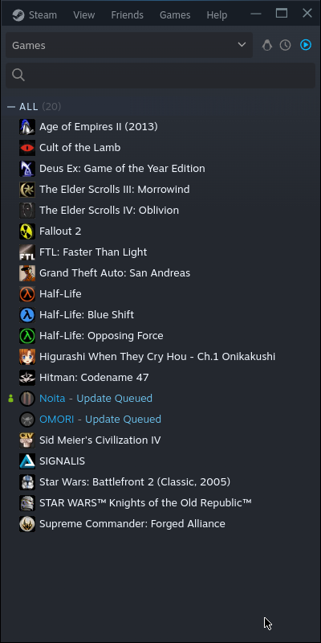

+++
title = "The first month of life with the Framework 13"
date = 2024-04-07T19:34:59Z
+++
## Preparation

I was starting to feel as if I needed to upgrade away from the Lenovo Thinkpad x270 because of performance issues and I had the money laying around to finally perform that upgrade. I settled upon the Framework 13 for ideological reasons, especially wanting a laptop that could last me a long time and be upgraded as I see fit, through generational improvements of the mainboard.

I ordered the Ryzen 5 7640U version without <abbr title="random-access memory">RAM</abbr> or an <abbr title="non-volatile memory express">NVMe</abbr> <abbr title="solid state drive">SSD</abbr>, so I was going to have to source myself both elsewhere. With help from a dear friend, I picked out the Kingston Fury Impact 32GB (2x16GB) 5600MHz DDR5 SODIMM set alongside the Crucial P5 Plus 1TB (which, I should've got a fancier larger SSD instead of, much as the dear friend suggested). These were ordered from Canada Computers with the help of the wife, so they took like a week to arrive (because coast-to-coast...).

I ordered 4 expansion cards with my Framework, 3 USB C expansion cards and 1 USB A expansion card. I am now aware that the USB A expansion card causes a constant power draw due to oversights in the design. I will eventually attempt to get another expansion card of some other variety, I already have a few ideas. I may even make my own!

I ordered an intel BE200 a while before this, intending to upgrade the Framework 13 to have WiFi 7, as at the same time I was upgrading the home WiFi to a Ubiquiti U7 Pro.

## Day 1!

Upon receiving the memory and storage, I prepared to install them on stream. Things went okay at first during the installation, the procedure for putting together the laptop is very straightforward, I would call it fun! The first thing I did was to install the WiFi 7 card, then the RAM and NVMe SSD. Upon attempting to boot it for the first time, it simply did not boot.

After troubleshooting for an hour, I discovered that the Intel BE200 is not in fact compatible with non-Intel platforms. I don't actually have any modern Intel platforms worth using this modem with, so it has effectively become e-waste to me. That really sucks, thanks Intel.

I set it up with a 75% charge limit to ensure longevity of the battery in the UEFI settings.

With this, my setup began; I installed NixOS with bcachefs for the root filesystem with <abbr title="full disk encryption">FDE</abbr>.

## Week 1

I decided to start modernizing my setup, so I moved to Hyprland initially as my window manager. I eventually got set up on that for a while, but I realised that Wayland has no way for taking ICC color profiles because the standard for such is currently being worked on as of 2024-04-07. I got settled in with the laptop and began to thoroughly enjoy the experience; 3:2 is probably my favourite aspect ratio for a display.

## Week 2

From here, I moved to GNOME 3 and at the time I was working on this setup, colord was broken due to an update to 1.4.7. I eventually decided to move back to Hyprland after a quick jaunt over to KDE in the process. I had to update konawall-py to have GNOME 3 and KDE support in the process of these moves.

I got secure boot working with the help of [lanzaboote](https://github.com/nix-community/lanzaboote).

## Week 3

I continued using the laptop during this period, but did not contribute to my infrastructure project. I spent the weekend in the United States of America and used it during then, too. I loaded games up on Steam and Lutris for potential play while there; Higurashi Chapter 1 seemed to work a charm with Proton, but not natively. Presumably this is due to missing dependencies in the FHS environment; I did not feel like investigating.

During this time period, however, I did put stickers on the laptop! ^~^

## Week 4

Instead of actually fixing the systemd service with the 3 lines required to set the state directory, the maintainer eventually opted to downgrade to 1.4.6. This was good enough for me, and now I can have moderately accurate colours.

I spent significant time loading up on old games and decided to move over to XFCE with Chicago95, just to add to the retro feels. To do so, I had to update konawall-py to have XFCE support.

Here's a picture of the results of my customizing:

Here's the lists of games I have installed, as pictures of the applications:

This brings us practically up to the current day, 2 days before a month has passed since the laptop was made operational. I have felt no buyer's remorse, no bad feelings about this laptop whatsoever.
