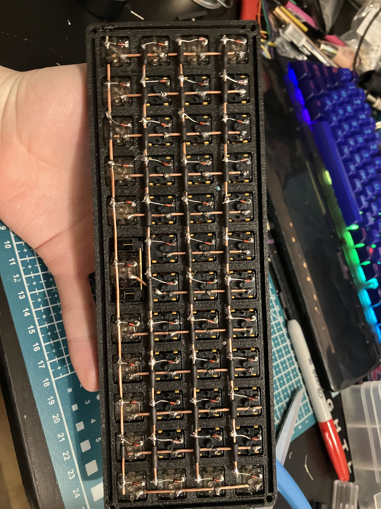
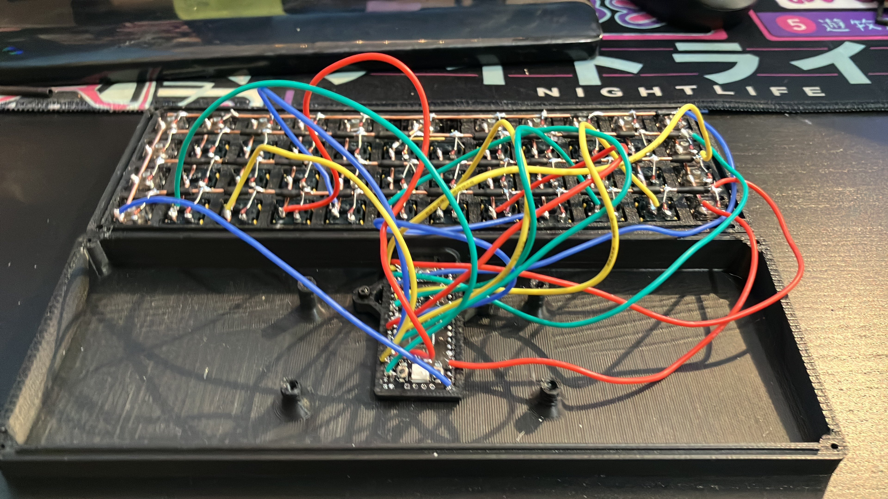
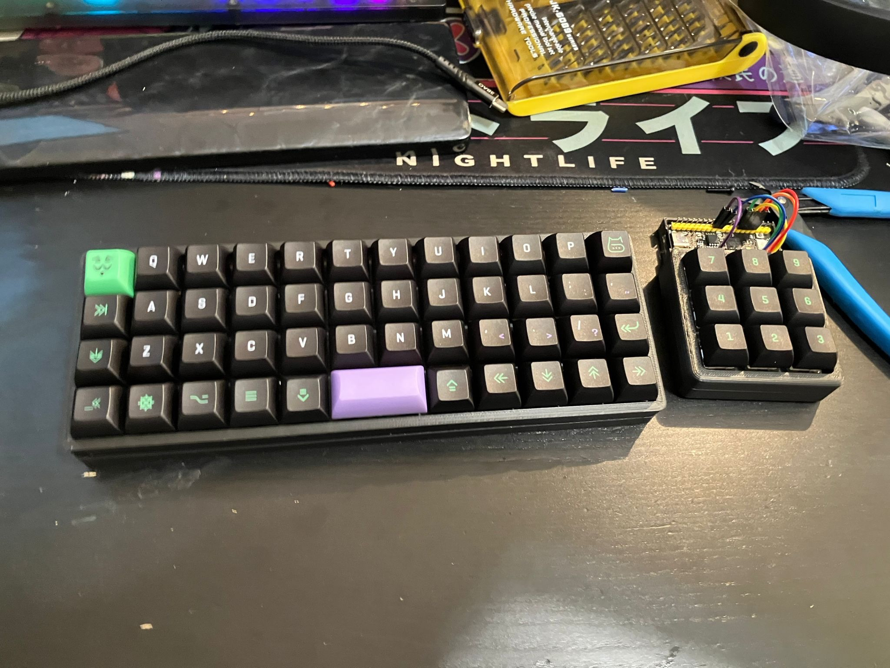
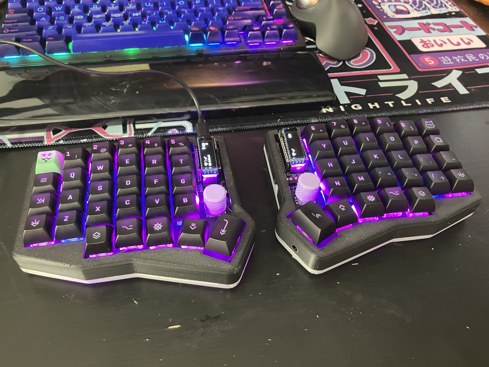

+++
title = "I built two keyboards over the last year!"
date = 2025-06-20T07:53:17Z
+++

## Handwired

Design: [Void40](https://www.printables.com/model/347534-void40-a-40-ortholinear-keyboard)

Inspired by a video sent to me by a friend, ["Building a Split USB-C Handwired Keyboard" by Joe Scotto](https://youtu.be/PDguuYMG0IQ), I started initially with a 3x3 macropad in the same style as Joe Scotto.

I moved onto a Planck-like shortly afterwards, initially I was using a large RP2040 devboard, but I settled on an RP2040 Zero (not pictured!).

Keyswitches:
* Inner: Matrix Lab FFFF (Tactile)
* Outer: Nightwalker Glow-in-the-Dark Nightcall (Silent Linear)

Stabilizers were hand-lubricated.

Keycaps were KAT Cyberspace.

## Sofle RGB

Case design: ["Sofle V2.1/RGB Sandwich Mount Case w/ Tenting" by onglez](https://www.thingiverse.com/thing:5407420)
PCB vendor: [PandaKB's modified Sofle RGB](https://pandakb.com/products/pcb-kit/sofle-rgb-mx-pcb-kit/) (I did not use the kit!)
Keyboard design: ["Sofle" by  Josef Adamcik, "Sofle RGB" by Dane Evans](https://josefadamcik.github.io/SofleKeyboard/) (Sofle RGB)

Keyswitches:
* Turquoise Tealios (Linears) for alphas
* Zealio V2 (Tactile) for all other keys

Keycaps are KAT Cyberspace.

I spent an awful lot of time debugging issues that were fundamentally my own fault for following the build guide wrong in one way or another, but I feel like it turned out very pretty.

[]
